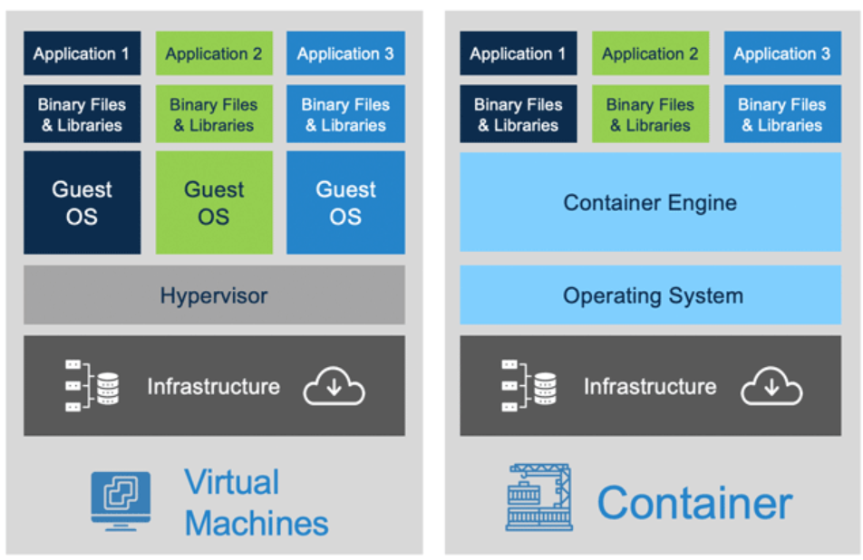

# Containers

# Images


https://mkdev.me/en/posts/dockerless-part-1-which-tools-to-replace-docker-with-and-why


docker container manifesto
https://github.com/moby/moby/blob/0db56e6c519b19ec16c6fbd12e3cee7dfa6018c5/README.md


Containers

- clone
- unshare
- namespaces
- cgroups

Docker - Overview
Docker - Engine
Docker - Containers
Docker - Images
Docker - Networks
bridge, none, host
default - bridge
docker run ubuntu --network=none

Docker is a container engine technology, which makes use of [LXC (LinuX Containers)](https://wiki.archlinux.org/title/Linux_Containers).

# [Docker Overview](https://docs.docker.com/get-started/overview/)

> Docker provides the ability to `package and run` an application in a loosely isolated environment called a container. The `isolation and security` allow you to run many containers simultaneously on a given host. Containers are `lightweight` and contain everything needed to run the application, so you do not need to rely on what is `currently installed on the host`.

# Docker Architecture


- Docker is written in golang.
- Docker uses a containerization method called
- Docker runs on a linux kernel.
- Uses a combination of namespaces and cgroups to provide isolation and security.

> Windows and Mac run docker in a linux VM.

# Arch overview

https://docs.docker.com/get-started/overview/

# Containers

Isolated group of processes running on a single host, that does a specific set of tasks/ features.

## Understanding containers

[chroot](https://man7.org/linux/man-pages/man2/chroot.2.html)

[pivot_root](https://man7.org/linux/man-pages/man2/pivot_root.2.html)

[namespcaes](https://man7.org/linux/man-pages/man7/namespaces.7.html)

[cgroups](https://man7.org/linux/man-pages/man7/cgroups.7.html)

- namespaces - controls what you see.
- cgroups - controls what you use.

Lets try a few things now.

```bash
docker run node:alpine
```

This command runs a node image that runs on an alpine linux distribution. Now lets see if the container is running.

```bash
docker ps
```

Wait, there is nothing there. Lets check all containers.

> Note: By default, docker ps lists all running containers, by passing a `-a` flag we are making it display all containers.

```bash
docker ps -a
```

Seems like the container exited just after we ran it.

The reason is, node:alphine is just the base image and we are not running any tasks/ processes in the image.

Lets run a process in the image.

```bash
docker run -d node:alpine sleep 100
```

Now, lets check if the container is running.

```bash
docker ps
```

> Containers are supposed to run a specific set of tasks/ processes/ feature sets.
> Once the task/ process is complete, the container exits

https://medium.com/@saschagrunert/demystifying-containers-part-i-kernel-space-2c53d6979504

[Linux kernel file system](https://www.kernel.org/doc/Documentation/filesystems/sharedsubtree.txt)

# Images

```
docker run -v VOLUME_ON_HOST:VOLUME_ON_CONTAINER IMAGE
docker run -d IMAGE
docker attach CONTAINER_ID
docker inspect CONTAINER_NAME | CONTAINER_ID
docker run -p HOST_PORT:CONTAINER_PORT IMAGE
docker logs CONTAINER_NAME
docker history IMAGE ?
```

```
FROM ubuntu

CMD sleep 5 # CMD ["sleep", "5"]
```

```
FROM ubuntu

ENTRYPOINT sleep # ENTRYPOINT ["sleep"]
```

With defaults

```
FROM ubuntu

ENTRYPOINT ["sleep"]

CMD 5
```

Defaults to 5 seconds.

```
docker run ubuntu 10
```

is similar to

```
FROM ubuntu

ENTRYPOINT ["sleep"]

CMD 5
CMD 10
```

entry point can also be passed as --entrypoint

```
docker run --entrypoint sleep ubuntu 10
```

https://www.docker.com/sites/default/files/d8/2019-09/docker-cheat-sheet.pdf
https://design.jboss.org/redhatdeveloper/marketing/docker_cheatsheet/cheatsheet/images/docker_cheatsheet_r3v2.pdf

## Building an image

Dockerfile

```
FROM node:alpine


COPY ./
```

Docker container escapes
https://blog.trailofbits.com/2019/07/19/understanding-docker-container-escapes/
https://betterprogramming.pub/escaping-docker-privileged-containers-a7ae7d17f5a1

Youtube

Containers
https://www.youtube.com/watch?v=8fi7uSYlOdc&ab_channel=GOTOConferences

Docker
https://www.youtube.com/watch?v=pTFZFxd4hOI&ab_channel=ProgrammingwithMosh
https://www.youtube.com/watch?v=fqMOX6JJhGo&ab_channel=freeCodeCamp.org


Containers
https://www.cncf.io/
https://opencontainers.org/
https://github.com/opencontainers/runtime-spec
https://kubernetes.io/blog/2016/12/container-runtime-interface-cri-in-kubernetes/

https://www.tutorialworks.com/difference-docker-containerd-runc-crio-oci/